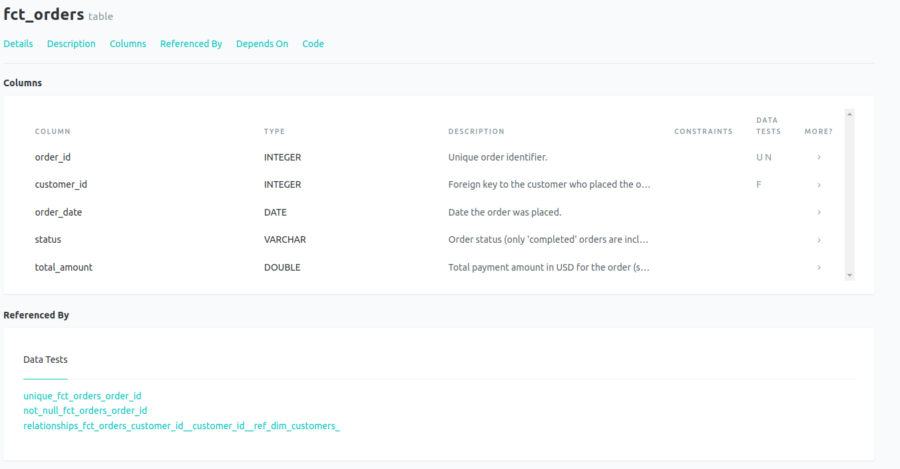
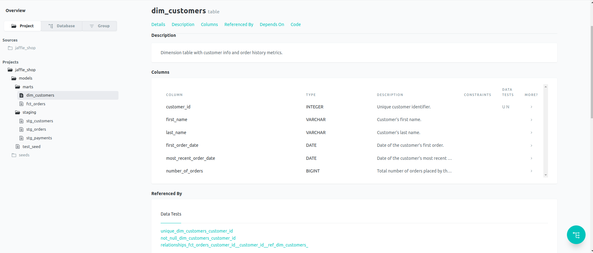
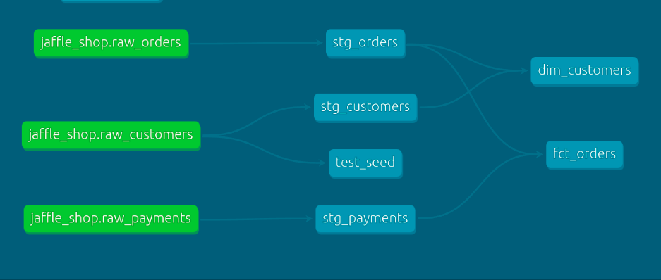

# Jaffle Shop

This dbt project transforms raw e-commerce data from the Jaffle Shop into clean, tested, and documented analytics models using DuckDB.

## Models

### Marts Layer
- **`dim_customers`**: One row per customer with order history metrics:
  - `first_order_date`
  - `most_recent_order_date`
  - `number_of_orders`
- **`fct_orders`**: One row per *completed* order with total payment amount (sum of all payment methods)

#### Fact Orders

#### Customer Dimension

### Staging Layer
- `stg_customers`, `stg_orders`, `stg_payments`: Cleaned raw data with:
  - Consistent naming (`id` → `customer_id`, etc.)
  - Type casting (`order_date` → `DATE`)
  - Unit conversion (`amount` from cents → dollars)

  

## Testing
- **12 data tests** covering:
  - Primary key uniqueness & not-null constraints
  - Referential integrity (`fct_orders.customer_id` → `dim_customers`)
  - Valid order statuses (`placed`, `shipped`, `completed`, `returned`, `return_pending`)
- All tests pass
- Run through: dbt test

## 📚 Documentation
- Full column and model descriptions in `schema.yml`
- Interactive data catalog generated with `dbt docs generate`: http://localhost:8080/#!/overview/jaffle_shop 
- DAG shows clear lineage from raw → staging → marts

## 🏗️ Project Structure

jaffle_shop/
├── models/
│ ├── staging/
│ │ ├── stg_customers.sql
│ │ ├── stg_orders.sql
│ │ ├── stg_payments.sql
│ │ └── schema.yml ← tests & docs
│ └── marts/
│ ├── dim_customers.sql
│ └── fct_orders.sql
├── seeds/
│ ├── raw_customers.csv
│ ├── raw_orders.csv
│ └── raw_payments.csv
└── dbt_project.yml

